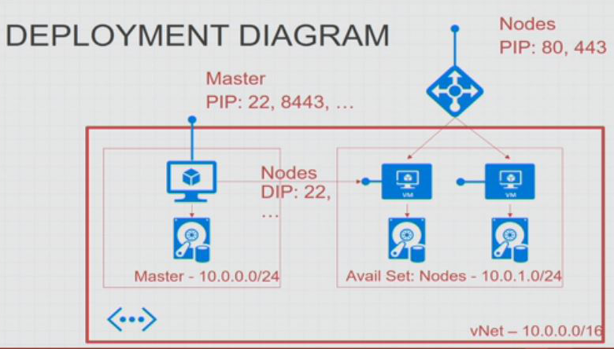

# Openshift Origin Spring Boot Techlab

Inhalt
<ol>
<li><a href="#einleitung">Einleitung</a>
<ol>
<li><a href="#komponenten">Komponenten</a></li>
<li><a href="#v2---v3-vergleich">V2 und v3 Vergleich</a></li>
<li><a href="#deployment-in-azure">Deployment in Azure</a></li>
</ol>
</li>
<li><a href="#openshift-client-tools-oc-installieren">Openshift Client Tools 'oc' installieren</a></li>
<li><a href="#bei-openshift-anmelden">Bei Openshift anmelden</a>
  <ol>
  <li><a href="#web-console">Web Console</a></li>
  <li><a href="#client-tool-oc">Client Tool 'oc'</a></li>
  </ol>
</li>
<li><a href="#projekt-setup">Projekt Setup</a></li>
<li><a href="#application-health">Application Health</a>
  <ol>
  <li><a href="#health-in-spring-boot">Health in Spring Boot</a></li>
  <li><a href="#liveness-probe">Liveness Probe</a></li>
  <li><a href="#readiness-probe">Readiness Probe</a></li>
  </ol>
</li>
</ol>

# Einleitung


Wir verwenden Openshift Origin. Weitere Varianten von Openshift sind Openshift container plattform, Openshift dedicated und Openshift online.

weitere Information zur Architektur von Openshift

1. https://docs.openshift.org/latest/architecture/index.html

2. https://github.com/appuio/techlab/blob/lab-3.2/labs/01_quicktour.md


## Komponenten

* Projects
 In Openshift a project is a kubernetes namespace with additional attributes. With a projects other resources are grouped.
 Openshift uses software defined network (SDN) to isolate projects from each other as much as possible.

* Container and Images
 Everything runs in a container. container are either build by source 2 image (S2I Build containers) or pulled from docker registry. Created container are pushed in a image registry to be later deployed and run. One container can consist of for example ubuntu + java + wildfly + application.

* Pods and Services
 A pod contains one or more container and is the unit managed (start, stop, restart, scale) by kubernetes at runtime.
 Within a projects a set of pods (replicated set) can be identified by services. each searvices can be exposed to the outside of openshift with routes.

## v2 <-> v3 Vergleich

| Version 2        | Version 3               |
|------------------|-------------------------|
| Namespace/Domain | Project                 |
| Gear             | Container               |
| Cartridge        | Docker Image (Template) |
| rhc              | oc                      |

## Deployment in Azure



Für mehr Information über das Deployment 

1. https://github.com/borehack/openshift-origin-on-azure-workshop#deployment-on-azure

2. https://github.com/Azure/azure-quickstart-templates/tree/master/openshift-origin-rhel

3. http://developers.redhat.com/blog/2016/10/11/four-creative-ways-to-create-an-openshiftkubernetes-dev-environment/

## Openshift Client Tools 'oc' installieren
Von der Webseite
 
 https://github.com/openshift/origin/releases/tag/v1.2.2

lade das die richte openshift-origin-client-tools-v1.2.2 Version für deine Umgebung runter und lege die Datei in ein Verzeichnis das im Pfad ist.
 
starte ein Terminal und überprüfe die Version
 
```sh
$ oc version
oc v1.2.2
kubernetes v1.2.0-36-g4a3f9c5  
```

## Bei Openshift anmelden
 
Um Openshift zu bedienen kann entweder die Web Console verwendet werden oder die Client Tools 'oc' console.

Das SLL Zertifikat ist self-sign daher muss es separat akzeptiert werden.

### Web Console

Die Url für die Web Console ist 

https://openshift-rg01-master.northeurope.cloudapp.azure.com:8443/console

### Client Tool 'oc'

Mit dem folgenden Befehl anmelden.

```sh
$ oc login https://openshift-rg01-master.northeurope.cloudapp.azure.com:8443
```

## Projekt Setup

Leider ist es nicht möglich direkt ein Spring Boot Projekt in Openshift zu deployen. Weil Openshift auf Docker Container setzt kann man jedoch jeden beliebigen Container deployen. Es gibt ein Container von codecentric der aus einem github Repository mit maven ein Spring Boot Projekt baut und die jar Datei dann in einen Container ablegt der dann auf Openshift laufen kann. Dieses Vorgehen schauen wir uns jetzt genauer an.

```sh
# ein neues Projekt erstellen.
$ oc new-project <name>

# ein Beispiel Spring Boot Project anlegen.
$ oc new-app codecentric/springboot-maven3-centos~https://github.com/codecentric/springboot-sample-app.git

# den Status vom Deplyoment überwachen. Entweder in der Web Console oder mit dem Befehl
oc status

# wenn das Deployment abgeschlossen ist sollte ein neuer pod und ein service laufen
oc get pods
oc get services

# wir überprüfen ob der Service bereits von Aussen sichtbar ist.
oc get routes

# dieser Serivce ist noch nicht von Aussen sichtbar es gibt keine Route. Um dies zu ändern erstellen wir eine.
oc expose service <service name>

```

jetzt ist der Spring Boot Service von Aussen erreichbar.

Wenn wir oc status ausführen bekommen wir eine Warnung wie folgt

```sh
dc/springboot-sample-app has no readiness probe to verify pods are ready to accept traffic or ensure deployment is successful
```

## Application Health

Für Openshift gibt es zwei verschiedene Tests die man einrichten kann.
1. Testen ob ein Programm noch lebt und wenn nicht eine neue Version starten.
  dieser Test wird verwendet wenn ein Programm bereits gestartet ist.
2. Testen ob ein Programm bereit ist verwendet zu werden.
 dieser Test wird verwendet wenn ein Programm deployt wird. Damit wird überprüft wann der Traffic auf die neue Version umgeleitet werden kann.

Weitere Information dazu auch unter folgendem Link:
https://docs.openshift.org/latest/dev_guide/application_health.html

### Health in Spring Boot

Um eine liveness oder rediness probe hinzuzufügen forken wir das Projekt von github.

https://github.com/codecentric/springboot-sample-app.git

checken es lokal aus fügen dem pom.xml die folgende dependency hinzu

```xml
		<dependency>
			<groupId>org.springframework.boot</groupId>
			<artifactId>spring-boot-starter-actuator</artifactId>
		</dependency>
```

diese Änderung einchecken und pushen.

Dann ein neues Projekt anlegen wie oben und euer eigenes Repository (eben forked) deployen

```sh
oc new-app codecentric/springboot-maven3-centos~https://github.com/<dein github user>/springboot-sample-app.git
```

auch diesen Build und Deployment kann man mit oc status oder über die Web Console überwachen.
Wenn das Deplyoment erfolgreich wollen wir auch diesen Service nach Aussen sichtbar machen.

```sh
# erst den serivce namen ermitteln
oc get services

# dann den serivce nach Aussen sichtbar machen
oc expose service <service name>
```

jetzt können wir auf diesem Service /health aufrufen.

siehe https://spring.io/guides/gs/spring-boot/ für mehr Details.

### Liveness Probe

Wir nutzen die /health URL um eine liveness Probe für unser Projekt einzurichten. Die liveness Probe wird von Openshift regelmäßig überprüft. Wenn dieser Test fehlschlägt dann startet Openshift das Projekt neu.

```sh
# erst den namen der deployment configuration ermitteln
oc get deploymentconfig

# dann diese deployment configuration ändern
oc edit dc <deployment config name>
```

unter diesem Pfad 

```xml
spec:
  [......]
  template:
    [......]
    spec:
        [......]
        resources: {}
```

die liveness probe hinzufügen:

```xml
spec:
  [......]
  template:
    [......]
    spec:
        [......]
        resources: {}
        livenessProbe:
          failureThreshold: 3
          httpGet:
            path: /health/
            port: 8080
            scheme: HTTP
          initialDelaySeconds: 10
          periodSeconds: 10
          successThreshold: 1
          timeoutSeconds: 1
```

Diese Änderung speichern und den Editor schliessen. Openshift merkt die Änderung sofort und startet ein neues Deployment (die Configuration geändert).

Durch die liveness Probe können wir einen Pod löschen und Openshift wird sofort einen neuen starten. Openshift überprüft regelmäßig ob die gewünschte Anzahl Pods läuft. Wenn das nicht der Fall ist startet es mehr Pods.

In einen Terminal Fenster können die Pods überwacht werden

```sh
oc get pods -w
```

In einem anderen Termain Fenster kann der aktuelle Pod gelöscht werden

```sh
oc get pods
oc delete pod <pod name>
```

### Readiness Probe


Wir nutzen die /health URL um damit einen rediness Check in Openshift zu definieren. Erst wenn /health erfolgreich aufgerufen werden kann ist unser Service bereit für Traffic.

```sh
# erst den namen der deployment configuration ermitteln
oc get deploymentconfig

# dann diese deployment configuration ändern
oc edit dc <deployment config name>

```
unter diesem Pfad 
```xml
spec:
  [......]
  template:
    [......]
    spec:
        [......]
        resources: {}
```

die rediness probe hinzufügen:

```xml
spec:
  [......]
  template:
    [......]
    spec:
        [......]
        resources: {}
        readinessProbe:
          httpGet:
            path: /health/
            port: 8080
            scheme: HTTP
          initialDelaySeconds: 10
          timeoutSeconds: 1
```

Diese Änderung speichern und den Editor schliessen. Openshift merkt die Änderung sofort und startet ein neues Deployment (die Configuration geändert).

Wenn man über das Terminal oder die Web Console den Service hochskaliert sieht man jetzt das erst der Docker Container verfügbar ist (hell blau) und dann die Application verfügbar ist (dunkleres blau).

```sh
# Information über die replicas
oc get rc

# skalieren auf 3
oc scale --replicas=3 rc <rc name>

# überprüfen
oc get rc 

# oder
oc get pods -w
```

# Quellen

1. https://docs.openshift.org/latest/welcome/index.html

2. https://github.com/appuio/techlab

3. https://blog.codecentric.de/en/2016/03/deploy-spring-boot-applications-openshift/


short url to this repository : https://goo.gl/cF0f4n
